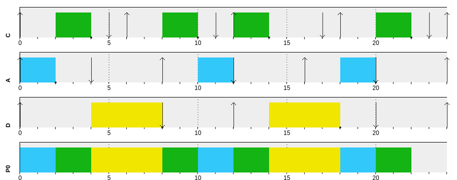
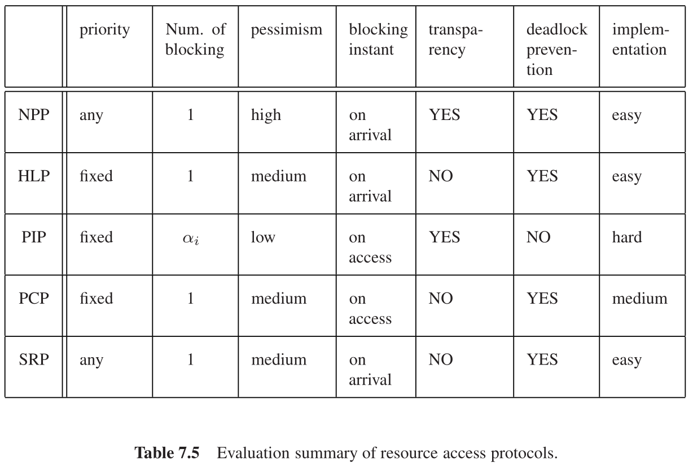

> [!NOTE]  
> Subject is over. This project will no longer be maintained.

# TiROS

This project contains a heavily modified version of MiROS that uses an EDF (Earliest Deadline First) scheduler. Given the choice to implement a Rate Monotonic, Deadline Monotonic or EDF scheduler, the EDF was chosen for it's expandability and ease of implementation.

It has support for periodic tasks with specific deadlines and aperiodic tasks using a Total Bandwidth Server.

## Tracer
This project also contains a tracer in `tools/tracer.py`. Using matplotlib and pyserial, it's possible to visualize when and for how long each thread is executing.

It's necessary to adjust the `traceds` list in the Python script based on your task set and  define `OS_DEBUG_USART` when compiling.

There's also the possibility to use an oscilloscope or a logic analyzer to debug your tasks. Make sure to set the define `OS_DEBUG_GPIO`, and then hook up your probes to each thread's debug pin. The debug pins reside in GPIO A, and their number is the threads ID (0 for the idle thread, 1 for the server thread, and then assigned incrementally for each configured thread).

## Periodic tasks

The working principle is the global tick counter `os_ticks` and the `activation_time` variable contained in each task's TCB (Thread Control Block). This structure was chosen because if the `activation_time` is in the future, the task has not yet been activated; if it's in the past, the thread is active and its absolute deadline can be calculated by adding `relative_deadline` to the `activation_time`; thus making it simple to calculate everything the scheduler needs.

Having each active thread's absolute deadline, when the scheduler is called, it searches for the earliest one, and switches to it. Upon terminating execution, the task `period` is added to its `activation_time`.

### Example

The following task set:

|Task    |Computation Time|Deadline|Period|
|--------|----------------|--------|------|
|Correr  |               2|       5|     6|
|Água    |               2|       4|     8|
|Descanso|               4|       8|    12|

[SimSo](https://projects.laas.fr/simso/simso-web) yields the following results:

And after being run on this operating system, this is the output from `tracer.py`:

And this is the output from PulseView, a logic analyzer:

## Aperiodic tasks

Many aperiodic servers were researched in order to add this capability to the operating system. Given that EDF is used to schedule the periodic tasks, a dynamic priority server must be used. The following servers were considered: Dynamic Priority Exchange, Dynamic Sporadic, Total Bandwidth, Earliest Deadline Late and Improved Priority Exchange.

The Total Bandwidth Server was chosen because it's simple and elegant to implement, and it's able to achieve near-optimality, only losing to the Improved Priority Exchange Server.

It works by assigning an absolute deadline $d_k$ to the $k$th aperiodic request arrived at time $t=r_k$

$$ d_k = max(r_k, d_{k-1}) + \frac{C_k}{U_s} $$

where $C_k$ is the execution time of the request and $U_s$ is the server utilization factor (that is, bandwidth). By definition $d_0=0$.

To actually make this a *Total* Bandwidth Server, $U_s=1-U_p$, where $U_p$ is the utilization of the periodic tasks.

### Example

Given the following task set:

|Task  |Computation time|Deadline|Period|
|------|----------------|--------|------|
|Task 1|               3|       3|     3|
|Task 2|               2|       2|     2|

And a Total Bandwidth Server with bandwidth $U_s=1-U_p=0.25 \iff 1/U_s=4$. According to Buttazo, this should be the resulting schedule:

And, after running and debugging, this was the output from PulseView:

Matching perfectly.

## Resource access protocol

Buttazzo shows a table containing a summary and comparison of different resource access protocols

Given my personal time constraints during the development of this operating system and high concurrent demands in my life at the time, unfortunately I had to choose the simplest protocol, the Non-Preemptive Protocol (NPP).

The NPP works by prohibiting a task from being preempted while it's executing a critical section. In practice, it does that by either raising the priority of the executing task to the highest priority level or disabling interrupts altogether. The latter approach was chosen for this project.

The interrupt control happens in the `semaphore_wait` and `semaphore_signal` function. Note that with this configuration, it is impossible to have nested critical sections.

## Final Demonstrator

The final demonstrator consists on a control system with 3 tasks, one to measure, one to calculate and one to actuate. They were designed with the deadline equal to the period, with the following parameters:

|Task     |Computation Time (ms)|Period (ms)|
|---------|---------------------|-----------|
|Measure  |                   10|         50|
|Calculate|                   25|         50|
|Actuate  |                    5|         50|

As each task needs a value from the previous task, they all share the same period, which is the rate at which the sensor is able to provide us with data. The actuate task just sets a register, so it has a very short computation time. The measurement task has to wait for the sensor to provide it with data, so it has a longer computation time. The calculate task was originally planned to do soft floating-point operations, so it has the longest period. The latest solution uses integer arithmetic, so such a long period is not necessary, however, it still works and still fits, so it was kept.

There are four semaphores (representing two producer-consumer pairs) to make sure the flow of information through the tasks is consistent.

A Total Bandwith Server was used to serve a very fast (1 ms computation time) aperiodic task that changes the reference value of the controller. The calculated $U_s$ was $0.2$.

I2C and VL53L0X libraries were taken from GitHub user MarcelMG. [2] [3]

## Compiling

You need `make`, `arm-none-eabi-gcc`, and `openocd` to build and flash this project. The Makefile has a `monitor` target, that by defaults uses GNU Screen to monitor the serial port.

# References

1. Giorgio C. Buttazzo. 2011. Hard Real-Time Computing Systems: Predictable Scheduling Algorithms and Applications (3rd. ed.). Springer Publishing Company, Incorporated.
2. G M. M. STM32F103C8T6. Available on: https://github.com/MarcelMG/STM32F103C8T6/tree/master/I2C1
3. G M. M. VL53L0X C library for STM32F103. Available on: https://github.com/MarcelMG/VL53L0X-STM32F103
